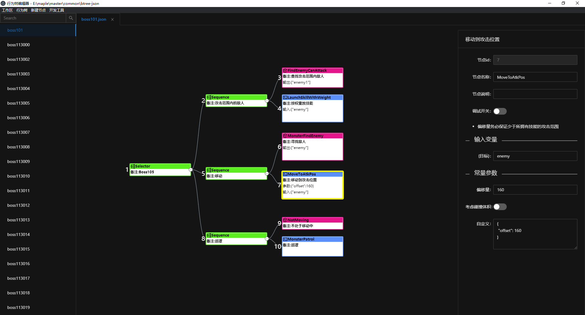

# 行为树编辑器(桌面版)
这是一个直观、可视化的行为树编辑器，行为树的保存格式为json，可以让策划自行去实现AI，技能，buff等复杂的游戏逻辑，从而减少不必要的沟通成本和提升开发效率。


## 使用方法
+ 打开编辑器
+ 工作区->节点定义->选择文件(json)
+ 工作区->选择目录(指定行为树所在的目录)
+ 工作区->另存为(将工作区保存起来，以便下次打开)
+ 行为树->新建

## 示例项目
+ 工作区: sample/sample-workspace.json
+ 节点定义: sample/sample-node-config.json
+ 行为树目录: sample/sample-workdir

## 节点定义
```typescript
interface ArgsDefType {
  name: string, // 字段名
  type: string, // 字段类型
  desc: string, // 字段中文描述
}
interface BehaviorNodeTypeModel {
  name: string;         //节点名称
  type?: string;        //节点分类(Composite,Decorator,Condition,Action)
  desc?: string;        //节点说明
  args?: ArgsDefType[]; //参数列表
  input?: string[];     //输入变量名
  output?: string[];    //输出变量名
  doc?: string;         //文档说明(markdown格式)
}
```
节点定义也是json格式，参照[sample/node-config.json](sample/node-config.json)，编辑器不提供节点定义的编辑，强烈建议节点定义文件由代码生成。

## 编译与构建
```shell
npm install # 安装依赖
npm start # 运行测试
npm run build # 编译exe可执行文件
```

## 技术栈
+ react + ts
+ g6
+ antd
+ electron

## TODO
+ 复制粘贴功能(跨工作区)
+ 历史记录(撤销/恢复)
+ 资源面板支持树型结构
+ 快捷键功能
+ 右键菜单
+ 联调功能

## About
目前编辑器还处于非常简陋的阶段，有问题可以联系作者(QQ1013299930)，本项目将长期维护，望前端大佬们多提点~